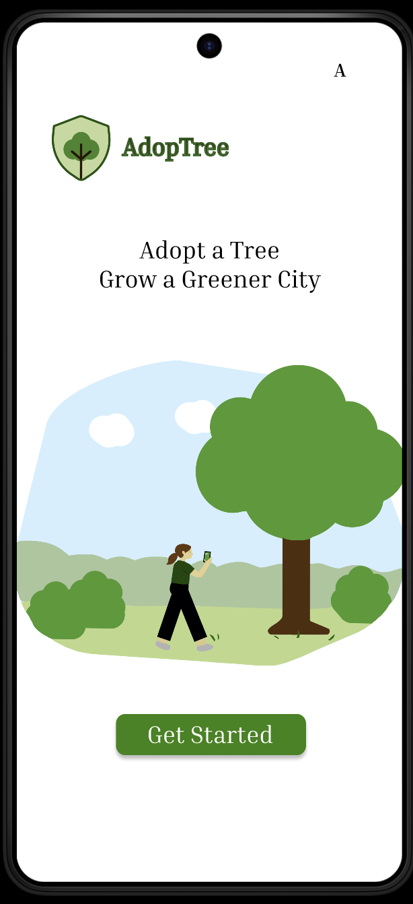
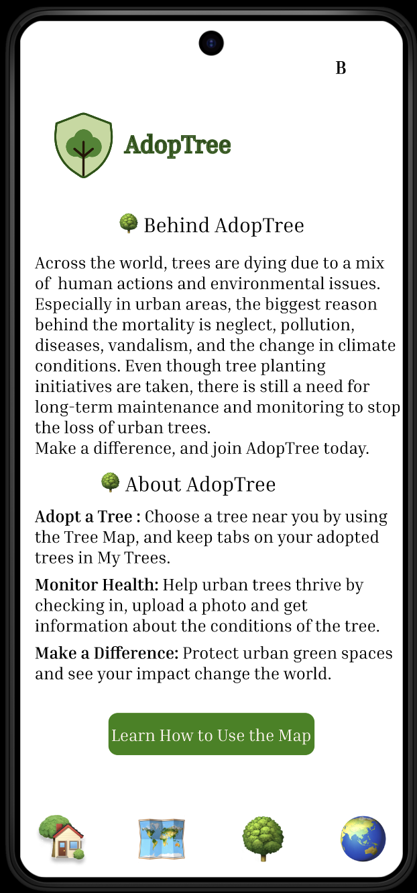
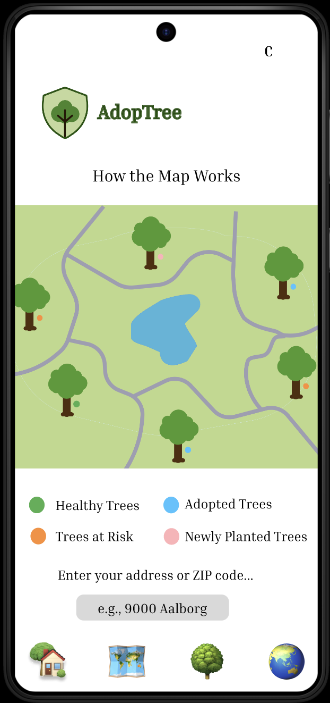
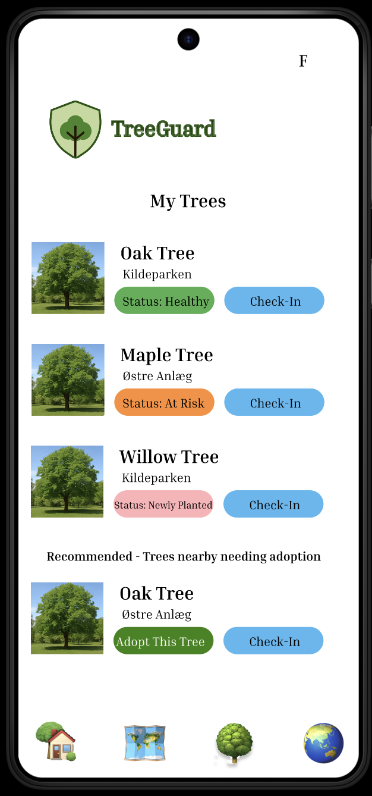
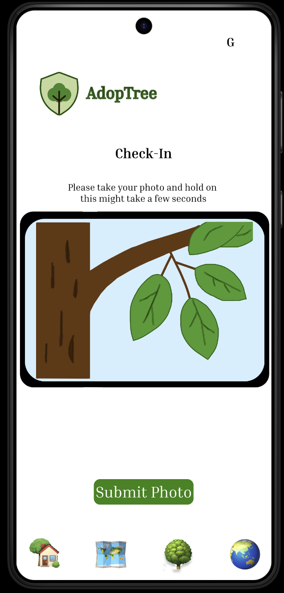
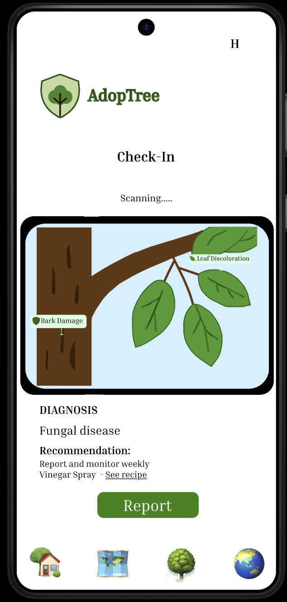

# AdopTree

A mobile application concept focused on tree adoption and environmental engagement, designed to make participation, information and user motivation more accessible through a structured digital experience.

---

## Overview

AdopTree is a high-fidelity mobile app prototype designed to make urban tree care more accessible and engaging.

The concept allows users to:

- Adopt trees near them
- Check in using photos
- Receive AI-based health feedback
- See their impact over time

This project explores how design, technology, and user motivation can support long-term environmental engagement.

---

## The idea

Urban trees are often overlooked and under-maintained, despite their importance.

Research showed that people:

* Want to help
* But lack awareness and tools
* Need simple and convenient ways to engage

AdopTree turns tree care into a personal responsibility, not just an abstract issue.

---

## Project Focus

The project explores how a digital product can:

- Communicate environmental impact in a clear way
- Support user motivation and engagement
- Guide users through a structured adoption flow
- Present information in a way that feels simple and accessible
- Combine purpose-driven design with a coherent mobile experience

---

## Key Features

* Tree Map: Location-based overview of nearby trees with health status
* Tree Adoption: Users adopt a specific tree and follow its development
* AI Check-Ins (Concept): Upload a photo → receive diagnosis + care recommendations
* My Trees: Track adopted trees and their status
* Impact View: Visualize collective engagement and contribution

---

## My Contribution

This was an individual project, and I was responsible for the full concept and design process.

### Concept Development
- Developed the overall application idea and structure
- Defined the main purpose and user journey
- Shaped the product concept around engagement and accessibility

### UX/UI Design
- Designed the interface and visual structure
- Built the high-fidelity prototype
- Created the user flow from onboarding to adoption-related interactions

### Product Thinking
- Worked with how information, actions and user motivation should connect
- Structured the prototype to reflect a coherent and intuitive digital experience

---

## Tools

- Figma
- Miro

---

### Prototype Link
[_Add Figma link here_](https://www.figma.com/proto/YqYrk4dyGdHaKIRCvaFymD/DEB?t=XHHJ5TwVAuCDYGo8-1&scaling=scale-down&content-scaling=fixed&page-id=0%3A1&node-id=61-178)

---

## Prototype

### Screenshots

<table align="center">
  <tr>
    <td align="center">
       
      <b>Main</b>
    </td>
    <td align="center">
       
      <b>About</b>
    </td>
  </tr>
  <tr>
    <td align="center">
       
      <b>How the Map Works</b>
    </td>
    <td align="center">
       
      <b>My Trees</b>
    </td>
  </tr>
</table>

<table align="center">
  <tr>
    <td align="center">
       
      <b>Check-In</b>
    </td>
    <td align="center">
       
      <b>Report</b>
    </td>
  </tr>
</table>

---

## Process

Built using the Design Thinking process:

* Research → Define → Ideate → Prototype

The final concept was selected based on:

* User motivation
* Feasibility
* Potential real-world impact

---

## Report

This project was developed independently as part of the Design and Evaluation of User Interfaces course.

[Download Report (PDF)](https://github.com/ceciliestadekristensen/AdopTree/raw/main/report/Adoptree.pdf)

---

## Note

This is a prototype project:

- No backend or real AI implemented
- AI check-in is conceptual
- Focus is on interaction design and user experience

---

## Purpose

The purpose of AdopTree was to explore how a mobile concept can combine engagement, usability and environmental communication in a way that feels meaningful and accessible for users.

---
